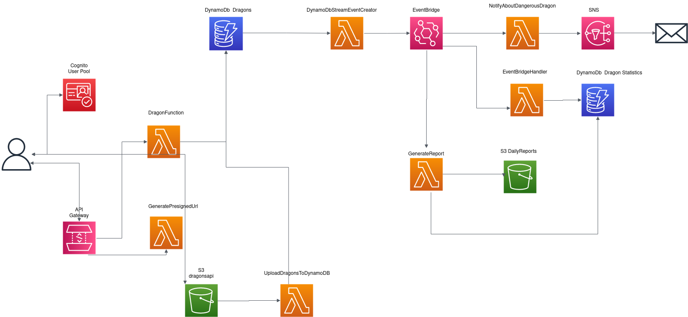

# App Dragons API

## Description
This project contains source code and supporting files for a serverless application that you can deploy with the SAM CLI. It includes the following files and folders.

- dragons_api - Code for the application's Lambda function.
- tests - Unit tests for the application code. 
- template.yaml - A template that defines the application's AWS resources.
- events - Data for tests
- layer - Layer collect all python libraries
- env_test.json - Collect all environment variables for local test. This file ovveride variables from template.yml


## Deploy dragon application

Update section Parameters in file template.yml in order to define your own bucket name, table name and other resource name

```bash
sam build
sam deploy --guided
```

The first command will build the source of your application. The second command will package and deploy your application to AWS, with a series of prompts:

* **Stack Name**: The name of the stack to deploy to CloudFormation. This should be unique to your account and region, and a good starting point would be something matching your project name.
* **AWS Region**: The AWS region you want to deploy your app to.
* **Confirm changes before deploy**: If set to yes, any change sets will be shown to you before execution for manual review. If set to no, the AWS SAM CLI will automatically deploy application changes.
* **Allow SAM CLI IAM role creation**: Many AWS SAM templates, including this example, create AWS IAM roles required for the AWS Lambda function(s) included to access AWS services. By default, these are scoped down to minimum required permissions. To deploy an AWS CloudFormation stack which creates or modifies IAM roles, the `CAPABILITY_IAM` value for `capabilities` must be provided. If permission isn't provided through this prompt, to deploy this example you must explicitly pass `--capabilities CAPABILITY_IAM` to the `sam deploy` command.
* **Save arguments to samconfig.toml**: If set to yes, your choices will be saved to a configuration file inside the project, so that in the future you can just re-run `sam deploy` without parameters to deploy changes to your application.

## Tests
## Use the SAM CLI to build and test locally
Run commands:
1) sam build
2) docker-compose up
3) sam local start-api --docker-network dragons --env-vars env_test.json
4) pytest -sv ./tests

## Feature list:

1) Has a CRUD API for dragons:
- GET /dragons - display a list of dragons (has pagination and filter by breed). For pagination user should set query parameter LastEvaluatedKey=last id of the dragon for current list. For filtering by breed user should set query param breed=value
- GET /dragons/{id} - get dragon by unique key
- POST /dragons - create a dragon. User should send next fields: 
  - (name - length between 3 and 10), 
  - (breed - length between 5 and 150), 
  - (description - can be empty),
  - (danger_rating - can be between 0 and 10, must be integer) 
- PUT /dragons/{id} - update the dragon
- DELETE /dragons/{id} - delete the dragon

2) Has Cognito UserPool for Authorization
- POST, PUT and DELETE action can only be provided by authorized users
- PUT and DELETE action can do only the owner of dragons
       
3) Loading dragons from a file:
- Created a bucket "dragonsapi" where you can upload a file with dragons in csv format. File should contains header [name,breed,danger_rating,description]
- Created lambda which pull this file, parse and put all dragons into DynamoDB
- Only authorized users can upload the file to bucket.
- GET /generate_url - Created a lambda that generates a presigned-url to upload the file to the bucket.


4) Created analytics how many operations have been provided with dragons during the day (created, updated, deleted).
The job create analytics based on Event Bridge rule every night and add this analytics to another bucket "dragonsapireport"
All data will be deleted from table in dynamo db for analytics because table has ttl=24h

5) Created notification by email when dragon was created or updated with danger rating more than 6


## Tech stack
 - AWS ApiGateway
 - AWS Lambda
 - AWS DynamoDB
 - AWS Cognito
 - AWS S3
 - AWS EventBridge
 - AWS CloudWatch
 - AWS IAM
 - AWS SAM 
 - AWS CloudFormation
 - AWS SNS
 - AWS Parameter Store
 - Docker-Compose


## Cleanup

To delete the sample application that you created, use the AWS CLI. Assuming you used your project name for the stack name, you can run the following:

```bash
sam delete --stack-name aws-dragons-api
```

## Diagram

